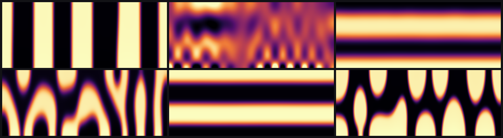
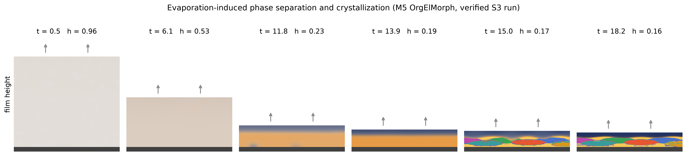
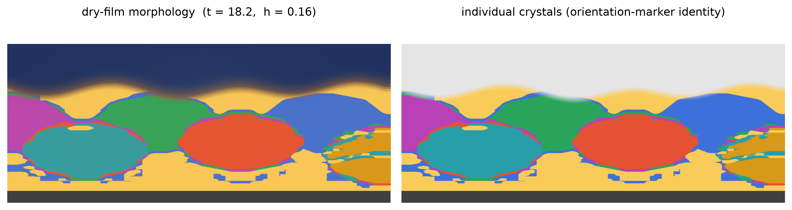

<h1 align="center">DiffSim</h1>

<p align="center">
  <strong>GPU-native, differentiable finite-element multiphysics on adaptive octrees.</strong>
</p>

<p align="center">
  
  
  
  
</p>

DiffSim solves PDEs on complex, moving, *optimizable* geometry — and computes
**exact gradients** of the results with respect to that geometry, the material
fields, the boundary data, and learned closures. It is built by the Baskar
research group as the successor to our production C++ stack (TalyFEM / Dendrite /
DendrIon), rethought from scratch to be GPU-resident, differentiable end-to-end,
and genuinely readable.

Classical simulation answers *"what happens?"*. Differentiable simulation answers
*"what should I change?"* — it turns a solver into an instrument for design,
inference, and discovery. The six images below are one such answer: organic-solar-cell
morphologies recovered from a 2012 benchmark by *learning* the free-energy
functional that produced them.

<p align="center">
  
  <br>
  <em>Six drying regimes from Wodo &amp; Ganapathysubramanian (CMS 2012), replicated
  device-bound on one A100 at the paper's 250×100 mesh — from these fields DiffSim
  recovers the Flory–Huggins parameters to 1e-7.</em>
</p>

## What makes it different

**Immersed geometry, never remeshed.** DiffSim uses the Shifted Boundary Method:
the domain lives in a structured octree cube and boundaries cut through cells
arbitrarily. Conditions are imposed on the nearest grid-aligned *surrogate*
boundary and corrected with a Taylor shift. Because geometry changes never remesh
a body-fitted grid (there isn't one), gradients never have to differentiate
through meshing — the enabling trick for shape optimization and inverse design.

**Differentiable by architecture, not by taping everything.** A simulation is a
sequence of *epochs* within which the mesh and classification are frozen, so the
solution is a smooth implicit function of the parameters. Gradients flow through
an adjoint solve, a Warp-taped parameter sweep, and a Torch geometry chain —
Krylov iterations and direct solves are *routed around*, never differentiated
through. Every gradient is verified three ways (custom adjoint, autograd twin,
finite differences); that gate has already caught a real compiler bug.

**GPU-resident where it counts.** NVIDIA Warp generates the hot FP64 element
kernels, and the production stepping paths keep the heavy work on the device.
The device-resident CSR assembly runs the per-step scatter with no host
round-trip — measured **7–11× faster** than the host-assembly path across 2-D
L6–L8, which closes the host-finalization gap and leaves the march
**solver-bound** — and the solve stays on the GPU through the fused single-sync
Krylov or a zero-copy cuDSS handoff (the block-CH *device* solver runs **8.4×
faster than host cuDSS** on the S2 morphology system). What is *not* yet fully
device-resident is stated plainly: the generic SciPy brick-assembly reference
path, several adjoint reductions, and the verification twins deliberately cross
to the host. Which physics/solver/adjoint combinations are device-resident,
hybrid, or reference-only — with their transfer counts and the numbers above —
is recorded per path in the [device-assembly](docs/dev/2026-07-13-m5-device-assembly.md)
and [block-CH](docs/dev/2026-07-13-blockch-mpf.md) dev notes.

**Taught properly.** The code is written to be read — every numerical decision is
documented where it lives, every claimed property has a test that measures it,
and the [curriculum](tutorials/README.md) takes a student from "solve Poisson on
a disk" to "recover a shape from sensor data" in an afternoon. For organic
electronics specifically, the
**[OrgElMorph onboarding course](tutorials/orgelmorph-course/)** is a standalone,
three-track course of **30 concepts** — **Physics** (P00 model hierarchy → P11
model-extension capstone), **Computation** (C00 weak-form-to-CUDA → C10
validation & uncertainty), and **Differentiation** (D1 → D7 inverse-design
capstone) — pairing a **178-page written document** (shipped as a
[PDF](tutorials/orgelmorph-course/latex/orgelmorph_course.pdf)) with runnable,
self-checking tutorials that call the same production bricks. It carries a
scientific-workflow harness (per-chapter YAML config → provenance → tolerance-checked
baseline), a mandatory tutorial template and instructor companion for every
chapter, and research-skills chapters on diagnostics, profiling, safe extension,
reproducible campaigns, and uncertainty — taking a new student from binary phase
separation to differentiable, GPU-native morphology simulation of real material
systems.

<p align="center">
  
  <br>
  <em>A film dries and structures itself (M5 OrgElMorph, verified run): a ternary
  polymer/fullerene/solvent blend loses solvent through its moving free surface
  (h: 1.00 &rarr; 0.16), stratifies into a polymer skin over a fullerene-rich
  sublayer, and crystallizes on quench — colors in the last frames are individual
  crystals tracked by their orientation markers.</em>
</p>

<p align="center">
  
  <br>
  <em>The dry film, two ways: composition with grain overlay (left) and the
  individual impinged crystals (right) — the model carries a per-crystal
  orientation field precisely so grains can be identified and counted.</em>
</p>

## Solver projects

Each family has a project page — what it solves, the weak form, a quickstart, the
validation numbers, and what gradients are available:

- **[Poisson / Shifted-Boundary](docs/projects/poisson-sbm.md)** — the immersed-diffusion foundation; asymptotic 2nd order and the dyadic-halo rule.
- **[Navier–Stokes](docs/projects/navier-stokes.md)** — incompressible flow around immersed bodies, p1 & p2; cavity vs Ghia, cylinder C_d 1.334.
- **[Heat & mass transfer](docs/projects/heat-mass.md)** — buoyant/thermal transport; de Vahl Davis Nusselt to 0.05 %.
- **[Phase field](docs/projects/phase-field.md)** — Cahn–Hilliard / Allen–Cahn / evaporating films; the Wodo replication and the first learned free energy. Extended to the M-component (OrgElMorph) blend: a differentiable multi-Cahn–Hilliard morphology stack with gradients w.r.t. the blend design parameters (χ-matrix, N, mobility, κ, mean composition), GPU-resident via cuDSS, and a learnable multi-component free energy fit by trajectory-matching.
- **[Differentiable design](docs/projects/differentiable.md)** — end-to-end adjoints; recovering a hidden INR shape from flow probes (bunny headline 1.23e-3).
- **[Adaptivity](docs/projects/adaptivity.md)** — spatial octree re-mesh with exact state transfer + BDF1/2 temporal LTE control.

## Author physics in the Integrands style

Physics is written the way TalyFEM/Dendrite/DiffPack users already know: you write
what happens at *one integration point*; the framework owns the element loop,
quadrature, assembly, constraints, solvers, and gradients.

```python
class PoissonBrick(CEquation):
    ndof = 1

    @staticmethod
    @wp.func
    def Integrands_Ae(fe, Ntab, dNtab, detJxW, dscale, nbf, dim, ndof, Ae, e):
        for a in range(nbf):
            for b in range(nbf):
                K = wp.float64(0.0)
                for k in range(dim):
                    K += fe_dN_s(dNtab, fe, a, k, dscale) \
                         * fe_dN_s(dNtab, fe, b, k, dscale)
                Ae[e, ndof * a, ndof * b] += K * detJxW
```

The contract (*the lego gate*): this brick, fed through the generic factory,
reproduces the hand-written production path bit-for-bit and the locked regression
baselines. **If you can write the weak form, you can extend DiffSim.**

The [fully-annotated `PoissonBrick`](src/diffsim/api/example_bricks.py) walks the
strong form → weak form → discrete form → code line by line; the phase-field and
Navier–Stokes bricks carry the same weak-form headers.

## Quickstart

```bash
python -m venv .venv && source .venv/bin/activate
pip install -e .                      # warp-lang, torch, numpy, scipy
pip install -e ".[cudss]"             # optional: NVIDIA cuDSS GPU-direct solver

pytest -q -m "not tier5"              # fast tiers (~minutes)
python tutorials/A_foundations/A1_mms_convergence.py     # your first solve
python benchmarks/navier-stokes/cavity_ghia.py           # a validation driver
```

Requires an NVIDIA GPU (FP64-capable), CUDA 12+, Python 3.10+. The first full
`pytest` run pays a one-time kernel compile (cached on disk afterwards); the 3-D
NS element kernel is a ~1 h compile gated behind `DIFFSIM_RUN_3D_NS=1`.

**Docs site** (project pages + curriculum + theory, rendered):

```bash
python tutorials/build_site.py && mkdocs serve   # http://127.0.0.1:8000
```

## Repository layout

```
src/diffsim/        the package — octree, mesh, geometry oracles, SBM,
                    assembly, physics bricks, solvers, steppers, adjoints
benchmarks/         literature-anchored validation drivers, grouped by physics
  poisson-sbm/  navier-stokes/  heat-mass/  phase-field/
  inverse-heroes/  performance/           (each with its own README)
tutorials/          the curriculum: tracks A–F + P, one runnable chapter each
tests/              the test suite (580 tests collected across 82 modules,
                    Jul 2026; the CPU-runnable subset runs in CI, the GPU
                    tiers on a self-hosted runner); baselines/ holds locked
                    values
docs/
  projects/         the per-solver project pages (start here)
  theory/           formulations, memos, student briefs
  course/           the LaTeX course document
  dev/              the lab notebook — findings logs, specs, milestone reports,
                    the full roadmap
  assets/           landing images + their (swappable) generator
cluster/            Nova/HPC campaign kits (sbatch + case tables)
```

## Documentation

- **[Solver project pages](docs/projects/README.md)** — the front door to each physics family.
- **[The curriculum](tutorials/README.md)** — tracks A–F + P; the scripts are the source of truth, the site is generated from them.
- **[Theory notes](docs/theory/)** — SBM/phase-field formulations, the cuFEM adjoint memo, student briefs.
- **[The lab notebook](docs/dev/)** — findings logs (compiler bugs, convergence traps, test-design lessons), specs, milestone reports, and the [full roadmap](docs/dev/roadmap.md).

## Status

Milestones **M0 through M4 are complete** — gated and committed. That spans the
octree/SBM foundations, incompressible Navier–Stokes at p1 and p2, coupled
heat/mass transfer, end-to-end adjoints with neural-SDF geometry, the full device
migration, differentiable adaptivity, and the phase-field stack with its learned
free energy.

**M5 (OrgElMorph)** adds the M-component morphology stack and makes it
differentiable end-to-end: a discrete implicit-function-theorem adjoint through
the multi-Cahn–Hilliard march yields exact gradients of a morphology objective
w.r.t. the blend design parameters (χ-matrix, N, Onsager mobility, gradient
energy κ, and the mean composition) — three-way verified (hand adjoint = autograd
twin = finite differences), CPU reference-grade *and* GPU-resident through a cuDSS
backend validated at 256×128. **M6** makes the physics learnable: a
gauge-anchored multi-component free energy and a named mobility closure fit by
trajectory-matching through the same verified adjoint (φ-only / K=0 to date;
crystallization-coupled learning is in progress). The **CHNS coupling brick** (SP-0, `src/diffsim/physics/chns.py`) completes the two-phase foundation: a coupled (u, p, φ, μ) monolithic Newton solver with variable density/viscosity, surface-tension-coupled Cahn–Hilliard, a three-way-verified discrete-IFT adjoint (density ratio, viscosity ratio, We, mobility, Fr), and a 3-D dam-break GPU smoke on 215 K DOF via cuDSS. See the
[roadmap](docs/dev/roadmap.md) for the measured evidence behind each, and the
milestone reports in `docs/dev/` for the full stories.

## Citation & license

DiffSim is released under the [Apache License 2.0](LICENSE). If you use it in
published work, please cite it via [`CITATION.cff`](CITATION.cff).

---

*Research software from the Baskar group (Iowa State University). Production
heritage: TalyFEM, Dendrite, DendrIon, proteus. Contact: baskigs@gmail.com.*
