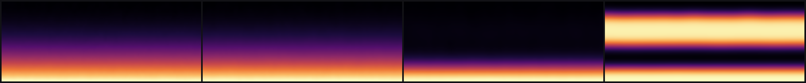

# Differentiable Design

**DiffSim's signature.** Every solver above is differentiable end-to-end: the
adjoint runs backward through the shifted-boundary operators, the assembly, and
the linear solve, delivering exact gradients of a scalar objective with respect
to shape, material fields, or boundary data. No FEM framework's project pages
usually carry a "gradients" row — this is the whole point of DiffSim.



*An inverse problem in the making: given sparse observations of a field like the
one above, recover the hidden parameters (geometry, diffusivity, free energy)
that produced it — by differentiating through the solver.*

## What "differentiable" means here

The forward solve is a sequence of differentiable primitives (Warp kernels,
sparse solves via cuDSS/adjoint, the SBM Taylor shift). We provide the reverse
pass for each, so `torch.autograd` (or a hand-rolled adjoint) gets exact
gradients — not finite differences, not a surrogate. Gradients are verified
against central differences at every rung:

| Gradient | Verified to |
|---|---|
| `dQ/dκ` (field diffusivity, Poisson/heat) | 3e-9 vs central FD |
| shape / traction (Navier–Stokes) | FD-matched; drives the drag hero |
| Flory–Huggins parameters (phase field) | 1e-7 recovery |
| adjoint across octree re-carve (adaptivity) | 1e-7 |

## The hero ladder

The showcase is recovering a hidden geometry edit — a GENIE implicit-neural
displacement of a shape — from only sparse flow probes:

```bash
python benchmarks/inverse-heroes/hero_h1_sphere_steady.py 4 1   # sphere, smoke run
python benchmarks/inverse-heroes/hero_m3_bunny_continuation.py  # bunny, the headline
```

| Hero | Result |
|---|---|
| Sphere INR, steady | recovery error **1.769e-3** |
| Stanford bunny INR, via h/epoch continuation | recovery error **1.23e-3** |

## The lessons (each failure converted to a rule)

- **Signal check before optimizing**: a sub-cell edit is invisible below the
  mesh scale — edit-scale vs `h` decides whether the gradient carries any
  information.
- **Gramian before compute**: rank-2 force aliasing (condition ~80) means two
  parameters move the observable identically; catch it with a Gramian before
  burning a GPU-day on an inverse run.
- **Continuation beats nonconvexity**: Gauss–Newton finds the wrong well even
  with a well-conditioned Gramian; h-continuation at the parameter level is what
  lands the bunny headline.

## Learn more

- Tutorials: E1 (shape optimization), E2 (GENIE INR + DiffSBM)
- Benchmarks: [`benchmarks/inverse-heroes/`](../../benchmarks/inverse-heroes/README.md)
- The Integrands brick API (write a new differentiable physics):
  `src/diffsim/api/equation.py`
- Provenance: `docs/dev/m1a-deferred-findings.md`, `docs/dev/m1d-milestone-report.md`
